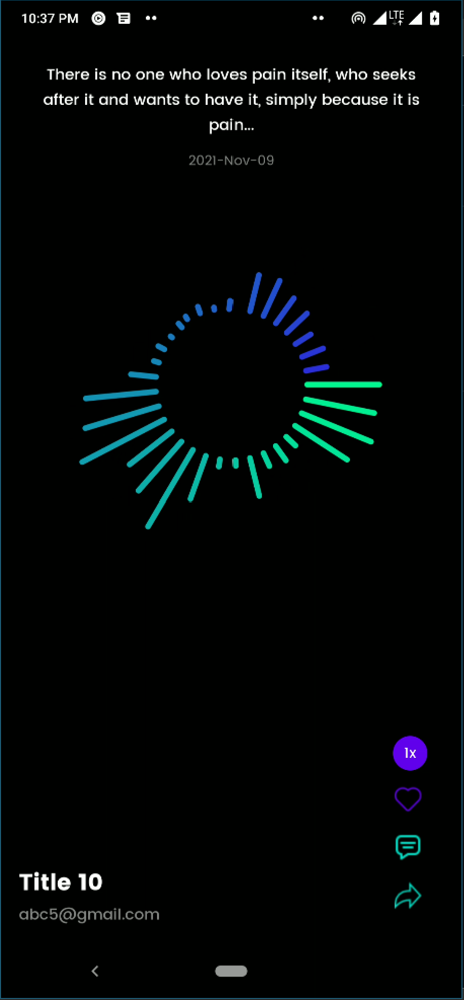
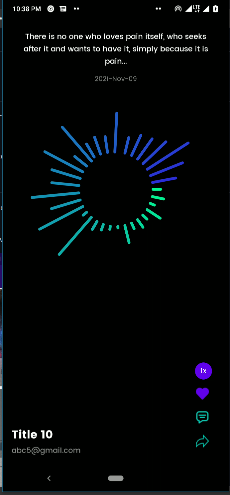

# :waxing_gibbous_moon: Nooble Engineering Challenge (Android Developer)

:link: Test instructions are [here](https://denim-trollius-83b.notion.site/Android-Engineer-Kotlin-f0b82df35e8d47b7bb59484937fb0760)

# :scroll: Description

This test solution is implemented with Clean Architecture

It is written 100% in Kotlin with both unit and integrated tests.🙂

## Languages, libraries and tools used

* [Kotlin](https://kotlinlang.org/)
* [RxKotlin](https://github.com/ReactiveX/RxKotlin)
* [RxAndroid](https://github.com/ReactiveX/RxAndroid)
* Android Support Libraries
* [Room](https://developer.android.com/training/data-storage/room)
* [Hilt](https://developer.android.com/training/dependency-injection/hilt-android)
* [Gson](https://github.com/google/gson)
* [Lottie](https://github.com/airbnb/lottie-android)
* [JUnit](https://junit.org/junit4/)
* [Mockito](http://site.mockito.org/)
* [Robolectric](http://robolectric.org/)

## Requirements

* JDK 1.8
* [Android SDK](https://developer.android.com/studio/index.html)
* Android 11 ([API 30](https://developer.android.com/preview/api-overview.html))
* Latest Android SDK Tools and build tools.

## Installation

* To run this code, clone this repository using this command `git clone https://github.com/chydee/Nooble-Assessment.git`
* Import into android studio
* Build the project and run on an android device or emulator

## Architecture

The architecture of the project follows the principles of Clean Architecture and MVVM. Here's how the project implements it:

The app when run will show you a a Tiktok style feed of songs parsed from a json file.

  
  

### App module

This layer makes use of the Android Framework and is used to create all of our UI components to display inside of the Main Activity. This layer contains the views(activities and fragments) and the ViewModel. The ViewModel receives its data from the use cases of the domain layer and then supplies the views.

### Domain module

The domain layer responsibility is to simply contain the UseCase instance used to retrieve data from the Data layer and pass it onto the Presentation layer.

### Data Module

The Data layer is our access point to external data layers and is used to fetch data from multiple sources (examples are cache and network). In this case, it gets data from the local source only. It contains an implementation of the Repository.

### Local Module

The local layer contains the business logic that converts the JSON to a list of data that we can use. It contains Room database implementation for storing of shorts.

## Appreciation

* [Kawsar Hossain](https://lottiefiles.com/61928-circular-audio-spectrum) - Lottie Animation

# :bulb: Motivation and Context

Working on this challenge I have enjoyed:

- Getting a feel of what modularization is all about
- Implementing with Kotlin

### :question: :thought_balloon: What I could have done better in attempting this test

- Handle error messages properly with more contexts
- Test end to end
- Play shorts in the background using actual services
- Handle AudioFocus in a clean way

...but there's more from where this came.
